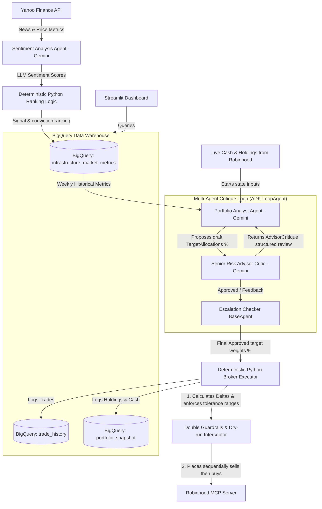
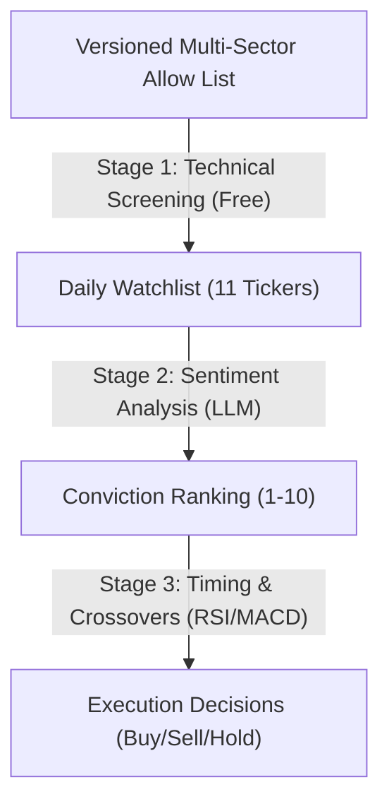

# Autonomous Stock Trader: End-to-End Agentic Portfolio Manager


The system leverages Google's Gemini models, the Agent Development Kit (ADK), Model Context Protocol (MCP) servers, and BigQuery data warehousing to evaluate market signals, manage risk, execute trades with real $$ on a $100 Robinhood account, and visualize performance in near real-time.

- **Live Deployed Dashboard**: [Streamlit Portfolio Dashboard](https://portfolio-dashboard-412197301452.us-central1.run.app)

---

## 🏗️ Project Architecture & Data Flow

Below is the end-to-end architecture showing how market data ingestion, sentiment analysis, risk limits, sandbox execution, audit logging, and the frontend dashboard are decoupled to prevent authentication blockages.



---

## 💡 Contest Writeup: Project Evaluation & Design

### 1. Overview 
* **The Problem**: Executing algorithmic trades directly based on raw LLM reasoning is highly risky (hallucinations, over-leveraging, target account confusion). Furthermore, querying brokerages in real-time on dashboards frequently fails due to session expirations or MFA blockages.
* **Our Thin Vertical Slice**: We designed a daily pipeline that automatically ingests tech news, scores sentiment using Gemini, applies deterministic risk checks, triggers a trading agent to execute queued orders via an MCP server on a $100 Robinhood account, logs states to BigQuery, and serves a decoupled, dark-themed Streamlit dashboard.
* **Target Audience**: Retail investors seeking safe, autonomous, AI-driven portfolio rebalancing with high observability.

### 2. Course Topics Demonstrated
* **Multi-Agent Coordination & ADK**: We decoupled logic into three specialized agents coordinated within a native ADK `LoopAgent` debate loop:
  - `sentiment_agent`: Analyzes market news and computes sentiment scores.
  - `portfolio_analyst`: Evaluates technical scores and conviction, proposing a target portfolio allocation (in percentages).
  - `senior_risk_advisor`: Reviews proposals as a critic, ensuring budget limits and technical entry thresholds are respected.
  - `escalation_checker`: Custom python agent that breaks the debate loop once a proposal is approved.
  - **Deterministic Authorization & Execution**: LLM allocations must pass final advisor approval plus the typed `p0-v1` policy engine before `BrokerExecutor` can access broker tools. ATR/SPY overrides, fail-closed broker parsing, stable decision IDs, and sell-only market dates are enforced in Python.
* **Model Context Protocol (MCP)**: The deterministic execution layer uses an active Robinhood MCP server to run queries (`get_portfolio`, `get_equity_positions`) and order tools (`place_equity_order`).
* **Double Account Guardrails & Interceptor Callback**:
  - *Prompt Protection*: Instructs the agent to only target the account ending in `48661`.
  - *Code Interceptor*: A Python callback inspects all tool arguments in real-time, blocking unauthorized assets, enforcing account validation, and returning simulated success packets when dry-run mode (`SKIP_LIVE_TRADES=true`) is active.
* **Telemetry & Decoupled Audit Logging (BigQuery)**: All daily recommendations, executed trades, and account equity/cash snapshots are written to GCP BigQuery. The Streamlit dashboard queries BigQuery directly, completely bypassing Robinhood at render time to prevent authentication blocks.

---

## 🚦 Architectural Constraints & Asset Screener
* **Allowed Ticker Universe**: Restricts trade execution to a checked-in, versioned **multi-sector large-cap universe** spanning information technology, communications, consumer, energy, financials, health care, industrials, materials, real estate, utilities, and defensive ETF fallbacks.
* **Dynamic Active Watchlist**: A Python pre-screener dynamically constructs the daily active list of at most 11 tickers from the broader universe (unless additional held positions require exit monitoring):
  1. It fetches current portfolio holdings from BigQuery and forces them to be on the watchlist so they are monitored for hold/sell decisions.
  2. It downloads price history for candidates and filters out stocks trading below their **50-day Simple Moving Average (SMA)**, **UNLESS** they are deeply oversold with a 14-day RSI $< 25$ (allowing value entries on deep pullbacks).
  3. It ranks remaining candidates by trend momentum ($\text{price} / \text{50-day SMA}$), admits at most two non-held candidates per sector, and pads with multi-sector defaults as needed.
* **Token & Cost Efficiency**: The heavy news scraping and LLM sentiment analysis are run **only** on the dynamically generated 11 active tickers (using 0 LLM tokens during screening), with at most the three newest articles per ticker and 33 articles per run.
* **Sandbox Limit**: Execution budget capped at **$100** total starting equity.
* **Traceability**: All execution steps, reasoning strings, and account snapshots must be logged to BigQuery.
  
---

## 🧠 Financial Analyst Logic (How It Works)

The pipeline employs a **three-stage quantitative & qualitative funnel** to filter, narrow down, and execute trades on stocks in a cost-efficient manner.



### Stage 1: Technical Screening & Filtering
Every day, a lightweight Python pre-screener scans the centralized multi-sector universe. This scan uses raw price data via `yfinance` (**0 LLM tokens**):
1.  **Holdings Override**: It checks the latest BigQuery portfolio snapshot. Any stock we currently own is automatically promoted to the watchlist so it is monitored for hold/sell decisions.
2.  **SMA Trend Filter & RSI Bypass**: Non-owned candidate stocks are filtered out if they are trading below their **50-day Simple Moving Average (SMA)**, **UNLESS** they are deeply oversold (14-day RSI $< 25$). This exception allows promoting high-quality value plays on deep corrections.
3.  **Momentum Ranking and Sector Balance**: The remaining candidates are scored by trend momentum ($\text{price} / \text{50-day SMA}$), with at most two non-held candidates admitted per sector.
4.  **Watchlist Padding**: If fewer than 11 stocks pass, multi-sector defaults pad the list to ensure exactly **11 active tickers** are analyzed.

### Stage 2: Sentiment Ingestion & Decay
The pipeline fetches the latest 24 hours of news for the 11 active watchlist tickers and retains at most the three newest articles per ticker. To save API costs, we partition the watchlist:
*   **Bypass & Decay**: If a stock has **no news** in the last 24h, the pipeline **bypasses Gemini** and mathematically decays its prior 5-day EWMA sentiment score by **30%** ($\text{score} = \text{EWMA} \times 0.7$) in Python.
*   **Gemini Ingestion**: If news exists, the news is passed to the **Sentiment Agent** (Gemini-Flash) to score conviction from `-1.0` to `+1.0`.
*   **Relative Ranking & Liquidation Floor**: Python sorts the 10 tickers by conviction and assigns a relative rank (1-10). The bottom 3 (ranks 1-3) receive a **`LIQUIDATE`** signal, **UNLESS** their 5-day EWMA sentiment is positive/neutral ($\ge +0.05$). If EWMA is $\ge +0.05$, the signal is overridden to **`HOLD`** to prevent spurious relative-rank liquidations.

### Stage 3: Multi-Agent Debate (Dual-Path Entry)
The target state is debated and finalized by a multi-agent critique loop:
1. **Portfolio Analyst Agent**: Proposes target stock allocations (percentages of total equity) based on today's watchlist and weekly metrics under one of two paths:
   * **Path A (Value/Dip Entry)**: Proposed for oversold pullbacks (RSI $< 30$).
   * **Path B (Momentum Breakout)**: Proposed for stocks hitting a 20-day high with a MACD bullish cross.
2. **Senior Risk Advisor Agent (Critic)**: Enforces path-dependent gates:
   * **For Path A**: Enforces the $\ge 10\%$ drawdown gate and $\le 0.4$ sentiment volatility gate.
   * **For Path B**: Bypasses the drawdown gate (allowing entry near all-time highs) and the 0.4 sentiment volatility gate (raising it to 0.85), provided breakout indicators are active.
   * **Minimum Holding Period**: Cannot exit positions held for $< 21$ days unless sentiment EWMA falls below $-0.5$.
3. **Escalation Checker**: Custom `BaseAgent` that terminates the LoopAgent when the proposal receives approval from the Advisor.
4. **Broker Executor**: Evaluates target weights vs current holdings and schedules trades sequentially (sells first, then buys) via the Robinhood MCP server.

---

## 🛠️ Deployed Streamlit Dashboard
The frontend runs as a containerized service deployed to **Google Cloud Run**.
- **Live URL**: [https://portfolio-dashboard-412197301452.us-central1.run.app](https://portfolio-dashboard-412197301452.us-central1.run.app)

---

## 🚀 Running the Pipeline & Deployment

This section provides all necessary setup, run, and deployment details to run the system or continue development.

### 📦 Prerequisites & Local Installation

1. **Install uv**: Install Astral's fast Python package manager and installer:
   - **macOS/Linux**: `curl -LsSf https://astral.sh/uv/install.sh | sh`
   - **Windows (PowerShell)**: `irm https://astral.sh/uv/install.ps1 | iex`
   - **Homebrew**: `brew install uv`
2. **Install Google Cloud SDK**: Required for database interactions (BigQuery) and frontend hosting (Cloud Run):
   - Follow instructions on [Google Cloud SDK installation](https://cloud.google.com/sdk/docs/install).
3. **Install Vertex AI Agent CLI (agents-cli)**: Required for backend agent deployment:
   ```bash
   uv tool install google-agents-cli
   ```
4. **Compile / Synchronize Virtual Environment**: Set up the local Python 3.12 environment, locking dependencies and checking for type/package consistency:
   ```bash
   cd agent
   uv sync
   ```
2. **Environment Variables**: Create a `.env` file in the project root or copy the template:
   ```ini
   # Vertex AI or Gemini API key configuration
   GEMINI_API_KEY=your_gemini_api_key_here
   
   # Robinhood MCP parameters
   ROBINHOOD_MCP_URL=http://localhost:8000/robinhood
   ROBINHOOD_ACCOUNT_NUMBER=XXXXX48661  # Security guardrail target account
   
   # Execution Flags
   SKIP_LIVE_TRADES=true   # Required while P0 work remains; account registry is an additional gate
   SKIP_INGESTION=false    # Set to true to query today's BQ logs instead of re-scraping yfinance
   ```

### 🚦 Running the Code

* **Run pytest Suite**: Verify code health and imports (use `PYTHONPATH=.` to ensure internal import paths resolve correctly):
  ```bash
  cd agent
  PYTHONPATH=. uv run pytest
  ```
* **Run Daily Ingestion & Account-Scoped Pipeline**: Ingests once, validates every selected account before processing, then runs accounts sequentially:
  ```bash
  cd agent
  SKIP_LIVE_TRADES=true uv run run_pipeline.py --all-accounts --run-kind execution
  ```
  An all-account run sends one consolidated Discord embed covering every registry
  account (including paused accounts), with friendly name, status, equity, cash,
  holdings, P&L versus configured starting capital, combined performance, the
  latest audited target allocation, and the orders tied to that decision.
  Paper accounts start with `$10,000`; capitalization is recorded as a portfolio
  snapshot rather than a fabricated trade.
  With `SKIP_LIVE_TRADES=true`, active `PAPER` accounts commit fills to their
  persistent simulated ledgers, while `REAL` accounts are restricted to
  `REAL_DRY_RUN`; no Robinhood order can be submitted. Paper order limits scale
  with paper equity, while the small real account retains its absolute broker
  notional cap.
* **Run Pipeline Skipping Ingestion (Dry-run Debugging)**: Bypass scraping and go straight to execution using cached today's BigQuery metrics:
  ```bash
  cd agent
  SKIP_LIVE_TRADES=true SKIP_INGESTION=true uv run run_pipeline.py --account exp-broad-atr-confirmation-v1 --run-kind execution
  ```
* **List configured accounts**: Prints friendly names, types, status, policy version, and live eligibility without exposing broker secrets:
  ```bash
  cd agent
  SKIP_LIVE_TRADES=true uv run run_pipeline.py --list-accounts
  ```
* **Set up or migrate BigQuery**: Run explicitly during initial setup or after a schema migration; normal pipeline runs do not provision or migrate BigQuery:
  ```bash
  cd agent
  uv run setup_bq.py
  ```
* **Run Streamlit Dashboard Locally**:
  ```bash
  cd frontend
  uv run streamlit run app.py
  ```

---

### 🌐 Cloud Deployment

#### 1. Backend Agent (Agent Runtime)
The trading agent orchestrator is built using the Vertex AI Agent Development Kit (ADK). The deployment target is **Agent Runtime** (Vertex AI Agent Engine) under region `us-east1` as specified in `agent/agents-cli-manifest.yaml`.

* **Prerequisite**: Install `agents-cli` globally:
  ```bash
  uv tool install google-agents-cli
  ```
* **Deploy Command**:
  ```bash
  cd agent
  agents-cli deploy
  ```

#### 2. Frontend Dashboard (Google Cloud Run)
The frontend Streamlit app is containerized via `frontend/Dockerfile` and serves on port `8080`.

* **Build & Deploy Command**:
  ```bash
  # Deploy directly from source directory
  gcloud run deploy portfolio-dashboard \
    --source ./frontend \
    --region us-central1 \
    --allow-unauthenticated
  ```
* **GCP Infrastructure & Data Warehouse (BigQuery)**:
  - BigQuery Dataset: `portfolio_analytics`
  - Tables:
    * `infrastructure_market_metrics`: Daily watches, technical indicators (RSI/MACD/SMA), and Gemini sentiment analysis outputs.
    * `trade_history`: Detailed submitted/accepted/filled/simulated order records keyed by decision ID.
    * `portfolio_snapshot`: Portfolio total equity, cash, and JSON-encoded holdings.
    * `execution_runs`: Policy decisions, reason codes, execution status, and reconciliation results.
    * `position_risk_state`: Monotonic ATR stop state for open positions.
    * `accounts`: Friendly account registry, brokerless paper/real account type, dashboard default, live eligibility, and validated policy JSON/hash.
  - Provisioned explicitly with `uv run setup_bq.py`; scheduled pipeline runs only perform operational reads and writes.
  - IAM Permissions: Make sure the service account running the Cloud Run Streamlit dashboard has `BigQuery Admin` or `BigQuery Data Editor` + `BigQuery Job User` roles.

---

## 📋 Open TODO List 
