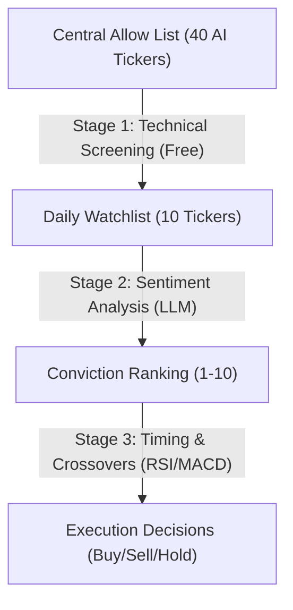

# Autonomous Stock Trader: End-to-End Agentic Portfolio Manager

This repository contains the **Autonomous Stock Trader**, a fully automated trading and portfolio management system built as a Capstone submission for Google's **5-Day AI Agents Intensive Vibe Coding Course**. 

The system leverages Google's Gemini models, the Agent Development Kit (ADK), Model Context Protocol (MCP) servers, and BigQuery data warehousing to evaluate market signals, manage risk, execute trades with real $$ on a $100 Robinhood account, and visualize performance in near real-time.

- **Kaggle Contest**: [Google AI Agents Intensive Capstone Project](https://www.kaggle.com/competitions/5-day-ai-agents-intensive-vibecoding-course-with-google)
- **Live Deployed Dashboard**: [Streamlit Portfolio Dashboard](https://portfolio-dashboard-412197301452.us-central1.run.app)

---

## 🏗️ Project Architecture & Data Flow

Below is the end-to-end architecture showing how market data ingestion, sentiment analysis, risk limits, sandbox execution, audit logging, and the frontend dashboard are decoupled to prevent authentication blockages.

---

## 💡 Contest Writeup: Project Evaluation & Design

### 1. Overview 
* **The Problem**: Executing algorithmic trades directly based on raw LLM reasoning is highly risky (hallucinations, over-leveraging, target account confusion). Furthermore, querying brokerages in real-time on dashboards frequently fails due to session expirations or MFA blockages.
* **Our Thin Vertical Slice**: We designed a daily pipeline that automatically ingests tech news, scores sentiment using Gemini, applies deterministic risk checks, triggers a trading agent to execute queued orders via an MCP server on a $100 Robinhood account, logs states to BigQuery, and serves a decoupled, dark-themed Streamlit dashboard.
* **Target Audience**: Retail investors seeking safe, autonomous, AI-driven portfolio rebalancing with high observability.

### 2. Course Topics Demonstrated
* **Multi-Agent Coordination & ADK**: We decoupled logic into three specialized agents coordinated within a native ADK `LoopAgent` debate loop:
  - `sentiment_agent`: Analyzes market news and computes sentiment scores.
  - `portfolio_analyst`: Evaluates technical scores and conviction, proposing a target portfolio allocation (in percentages).
  - `senior_risk_advisor`: Reviews proposals as a critic, ensuring budget limits and technical entry thresholds are respected.
  - `escalation_checker`: Custom python agent that breaks the debate loop once a proposal is approved.
  - **Decoupled Execution**: Execution logic is fully separated into a deterministic Python controller (`ExecutionController`), keeping brokerage calls completely isolated from LLM agents.
* **Model Context Protocol (MCP)**: The deterministic execution layer uses an active Robinhood MCP server to run queries (`get_portfolio`, `get_equity_positions`) and order tools (`place_equity_order`).
* **Double Account Guardrails & Interceptor Callback**:
  - *Prompt Protection*: Instructs the agent to only target the account ending in `48661`.
  - *Code Interceptor*: A Python callback inspects all tool arguments in real-time, blocking unauthorized assets, enforcing account validation, and returning simulated success packets when dry-run mode (`SKIP_LIVE_TRADES=true`) is active.
* **Telemetry & Decoupled Audit Logging (BigQuery)**: All daily recommendations, executed trades, and account equity/cash snapshots are written to GCP BigQuery. The Streamlit dashboard queries BigQuery directly, completely bypassing Robinhood at render time to prevent authentication blocks.

---

## 🚦 Architectural Constraints & Asset Screener
* **Allowed Ticker Universe**: Restricts trade execution to a centralized **40-stock universe** of liquid, large-cap AI core (NVDA, AMD, AVGO), chip foundry/memory (TSM, MU, ASML), cloud providers (MSFT, GOOGL, AMZN), grid power utilities (CEG, VST, ETN), and enterprise AI software/security (PLTR, CRWD) stocks.
* **Dynamic Active Watchlist**: A python-based pre-screener dynamically constructs the daily active list of 10 tickers from the 40-stock universe:
  1. It fetches current portfolio holdings from BigQuery and forces them to be on the watchlist so they are monitored for hold/sell decisions.
  2. It downloads price history for candidates and filters out stocks trading below their **50-day Simple Moving Average (SMA)**.
  3. It ranks remaining candidates by trend momentum ($\text{price} / \text{50-day SMA}$) and selects the top performers, padding with core defaults as needed.
* **Token & Cost Efficiency**: The heavy news scraping and LLM sentiment analysis are run **only** on the dynamically generated 10 active tickers (using 0 LLM tokens during screening), keeping API costs low and predictable.
* **Sandbox Limit**: Execution budget capped at **$100** total starting equity.
* **Traceability**: All execution steps, reasoning strings, and account snapshots must be logged to BigQuery.
  
---

## 🧠 Financial Analyst Logic (How It Works)

The pipeline employs a **three-stage quantitative & qualitative funnel** to filter, narrow down, and execute trades on stocks in a cost-efficient manner.

### Stage 1: Technical Screening & Filtering
Every day, a lightweight Python pre-screener scans the 40 stocks in the centralized allowed universe. This scan uses raw price data via `yfinance` (**0 LLM tokens**):
1.  **Holdings Override**: It checks the latest BigQuery portfolio snapshot. Any stock we currently own is automatically promoted to the watchlist so it is monitored for hold/sell decisions.
2.  **SMA Trend Filter**: Non-owned candidate stocks are filtered out if they are trading below their **50-day Simple Moving Average (SMA)**, avoiding declining stocks.
3.  **Momentum Ranking**: The remaining candidates are scored by trend momentum ($\text{price} / \text{50-day SMA}$). The top performers are selected to fill the remaining slots.
4.  **Watchlist Padding**: If fewer than 10 stocks pass, core defaults (like `NVDA`, `AMD`, and the hedge `TLT`) pad the list to ensure exactly **10 active tickers** are analyzed.

### Stage 2: Sentiment Analysis
The pipeline fetches the latest 24 hours of news for the 10 active watchlist tickers and passes it to the **Sentiment Agent** (Gemini-Flash):
*   **Conviction Score**: The agent assigns a raw sentiment score from `-1.0` (highly bearish news) to `+1.0` (highly bullish news).
*   **Deterministic Sorting**: Python code sorts the assets by sentiment score and assigns a relative rank from `1` (lowest score) to `10` (highest score).
*   **Core Signals**:
    *   **LIQUIDATE**: Assigned to bottom-ranked assets (Ranks 1, 2, 3).
    *   **STRONG BUY**: Assigned to top-ranked assets (Ranks 4-10) only if the sentiment score exceeds `0.2`.
    *   **HOLD**: Assigned to top-ranked assets with flat/uncertain sentiment scores ($\le 0.2$).

### Stage 3: Multi-Agent Critique Loop & Decoupled Execution
Instead of executing trades directly from LLM prompts, the target state is debated and finalized by a multi-agent critique loop, then executed deterministically:
1. **Portfolio Analyst Agent**: Proposes target stock allocations (percentages of total equity) based on today's watchlist and weekly metrics.
2. **Senior Risk Advisor Agent (Critic)**: Enforces technical entry guardrails (RSI <= 70, MACD momentum crossovers, hysteresis score swaps >= 0.3) and percentage budget safety bounds.
3. **Escalation Checker**: Custom `BaseAgent` that terminates the LoopAgent when the proposal receives approval from the Advisor.
4. **Execution Controller**: Evaluates target weights vs current holdings, applies cash buffer tolerance (5%-15% of equity) and position tolerance (+/- 3%) to prevent minor churn, and schedules trades sequentially (sells first, then buys) via the Robinhood MCP server. TLT remains the Treasury ETF fallback if technical criteria are not met.

---

## 🛠️ Deployed Streamlit Dashboard
The frontend runs as a containerized service deployed to **Google Cloud Run**.
- **Live URL**: [https://portfolio-dashboard-412197301452.us-central1.run.app](https://portfolio-dashboard-412197301452.us-central1.run.app)

---

## 📋 Open TODO List 

To complete your Kaggle Capstone Project submission, you must perform the following actions:

- [ ] **Record a Demo Video**:
  Record a 5-10 minute video showing:
  1. The code structure and dual-agent prompt setups.
  2. The BigQuery tables capturing signal logs and trade history.
  3. The live Streamlit dashboard showing allocations and executed trade logs.
- [ ] **Publish Walkthrough Link**:
  Upload the demo video (to YouTube, Loom, or Drive) and replace `[Insert Link to Your Recorded Walkthrough Video Here]` at the top of this README.
- [ ] **Post Submission Writeup on Kaggle**:
  Submit your Capstone write-up under the [Kaggle Capstone Project Discussion Forum](https://www.kaggle.com/competitions/5-day-ai-agents-intensive-vibecoding-course-with-google/discussion/709721) by creating a post containing this write-up, linking to this repository and your live dashboard URL.

## 🔮 Future Improvements

- [x] **Plot Agent's Alpha Against S&P 500 (SPY)**:
  Compare the agent's overall return against the S&P 500 index.
  * *Data Ingestion*: Add `SPY` to the daily data downloads in the pipeline.
  * *Dashboard Update*: Upgrade the portfolio performance chart in `app.py`. Query the total portfolio value history from BigQuery, fetch daily closing prices of `SPY` from `yfinance` for the same date range, normalize both starting values to 100 on Day 1, and plot them on a single line chart (Streamlit/Plotly) for visual benchmark comparison.
- [ ] **Headless Cloud Function Auth Migration**:
  Migrate the Robinhood MCP authentication mechanism to work in a serverless, headless GCP Cloud Function environment.
  * *Secret Storage*: Upload the local `~/.mcp-auth/` credentials (`tokens.json` and `client_info.json`) to Google Cloud Secret Manager.
  * *Function Startup*: Configure the Cloud Function to redirect the `HOME` directory to `/tmp`, pull the credentials from Secret Manager at startup, and write them into `/tmp/.mcp-auth/` so `mcp-remote` can authenticate without interactive browser checks.
  * *Refresh Sync*: Implement a post-run sync that uploads the refreshed token file back to Secret Manager to handle single-use refresh token expiration.
- [ ] **Reconciliation & Status Sync**: Query Robinhood orders via MCP post-execution to update local database logs with true execution status (filled vs. cancelled), actual filled share amounts, and final execution prices, rather than only displaying the submitted details.
- [x] **Hysteresis & Swap Buffer**: Only swap an existing holding if the new opportunity has a significantly higher conviction score (e.g., delta > 0.3) to prevent marginal churn.
  * *Rationale*: Prevents excessive trading churn, tax drag, and transaction friction caused by swapping assets due to tiny sentiment fluctuations (e.g. minor 0.05 sentiment delta).
  * *Implementation*: Enforced via **Rule 10** in `TRADING_AGENT_INSTRUCTION` inside [agent.py](file:///Users/sagar/Documents/ML/stock-trader/agent/app/agent.py), forcing the execution agent to check that the score delta is strictly greater than 0.3 before trading.
- [ ] **Minimum Holding Period**: Enforce a minimum holding time of 3-5 trading days for newly purchased assets before they can be sold, protecting the portfolio from day-to-day news noise (except during extreme bearish signals < -0.5).

*  # Redacted target account format: select account ending in 48661
        account_number = "XXXXX48661"  # Default fallback.. is this safe?