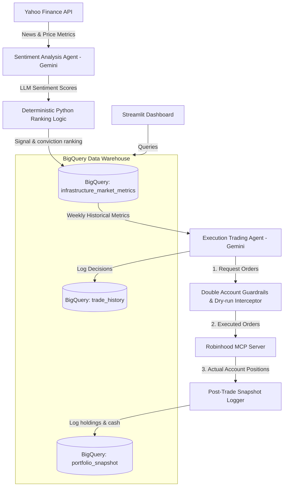

# Autonomous Stock Trader: End-to-End Agentic Portfolio Manager

This repository contains the **Autonomous Stock Trader**, a fully automated trading and portfolio management system built as a Capstone submission for Google's **5-Day AI Agents Intensive Vibe Coding Course**. 

The system leverages Google's Gemini models, the Agent Development Kit (ADK), Model Context Protocol (MCP) servers, and BigQuery data warehousing to evaluate market signals, manage risk, execute trades with real $$ on a $100 Robinhood account, and visualize performance in near real-time.

- **Kaggle Contest**: [Google AI Agents Intensive Capstone Project](https://www.kaggle.com/competitions/5-day-ai-agents-intensive-vibecoding-course-with-google)
- **Live Deployed Dashboard**: [Streamlit Portfolio Dashboard](https://portfolio-dashboard-412197301452.us-central1.run.app)

---

## 🏗️ Project Architecture & Data Flow

Below is the end-to-end architecture showing how market data ingestion, sentiment analysis, risk limits, sandbox execution, audit logging, and the frontend dashboard are decoupled to prevent authentication blockages.

---

## 💡 Contest Writeup: Project Evaluation & Design

### 1. Overview 
* **The Problem**: Executing algorithmic trades directly based on raw LLM reasoning is highly risky (hallucinations, over-leveraging, target account confusion). Furthermore, querying brokerages in real-time on dashboards frequently fails due to session expirations or MFA blockages.
* **Our Thin Vertical Slice**: We designed a daily pipeline that automatically ingests tech news, scores sentiment using Gemini, applies deterministic risk checks, triggers a trading agent to execute queued orders via an MCP server on a $100 Robinhood account, logs states to BigQuery, and serves a decoupled, dark-themed Streamlit dashboard.
* **Target Audience**: Retail investors seeking safe, autonomous, AI-driven portfolio rebalancing with high observability.

### 2. Course Topics Demonstrated
* **Multi-Agent Coordination & ADK**: We decoupled logic into two specialized agents:
  - `sentiment_agent`: Analyzes market news and computes sentiment scores.
  - `trading_agent`: Reviews cash, queries historical signals, manages weights, and places orders.
* **Model Context Protocol (MCP)**: The trading agent uses an active Robinhood MCP server to run queries (`get_portfolio`, `get_accounts`) and order tools (`place_equity_order`).
* **Double Account Guardrails & Interceptor Callback**:
  - *Prompt Protection*: Instructs the agent to only target the account ending in `48661`.
  - *Code Interceptor*: A Python callback inspects all tool arguments in real-time, blocking unauthorized assets, enforcing account validation, and returning simulated success packets when dry-run mode (`SKIP_LIVE_TRADES=true`) is active.
* **Telemetry & Decoupled Audit Logging (BigQuery)**: All daily recommendations, executed trades, and account equity/cash snapshots are written to GCP BigQuery. The Streamlit dashboard queries BigQuery directly, completely bypassing Robinhood at render time to prevent authentication blocks.

---

## 🚦 Architectural Constraints
* **Asset Universe**: I strictly limited to **10 assets** (9 AI infrastructure stocks: NVDA, AMD, TSM, MU, SMCI, DELL, VRT, ETN, CEG + 1 Treasury hedge: TLT). The hedge is only used when all AI stocks are down.
* **Sandbox Limit**: Execution budget capped at **$100** total starting equity.
* **Traceability**: All execution steps, reasoning strings, and account snapshots must be logged to BigQuery.
  
---

## 🛠️ Deployed Streamlit Dashboard
The frontend runs as a containerized service deployed to **Google Cloud Run**.
- **Live URL**: [https://portfolio-dashboard-412197301452.us-central1.run.app](https://portfolio-dashboard-412197301452.us-central1.run.app)

---

## 📋 Open TODO List 

To complete your Kaggle Capstone Project submission, you must perform the following actions:

- [ ] **Record a Demo Video**:
  Record a 5-10 minute video showing:
  1. The code structure and dual-agent prompt setups.
  2. The BigQuery tables capturing signal logs and trade history.
  3. The live Streamlit dashboard showing allocations and executed trade logs.
- [ ] **Publish Walkthrough Link**:
  Upload the demo video (to YouTube, Loom, or Drive) and replace `[Insert Link to Your Recorded Walkthrough Video Here]` at the top of this README.
- [ ] **Post Submission Writeup on Kaggle**:
  Submit your Capstone write-up under the [Kaggle Capstone Project Discussion Forum](https://www.kaggle.com/competitions/5-day-ai-agents-intensive-vibecoding-course-with-google/discussion/709721) by creating a post containing this write-up, linking to this repository and your live dashboard URL.

## 🔮 Future Improvements

- [ ] **Additional Technical Indicators**: Integrate `pandas-ta` to calculate extra technical signals (like RSI or MACD) from the `yfinance` history, giving the Trading Agent more robust entry/exit timing data alongside sentiment scores.
- [ ] **Dynamic Asset Screener**: Replace the hardcoded list of 10 AI stocks with an initial screening step where an agent dynamically finds the top trending tech/infrastructure stocks of the week.
