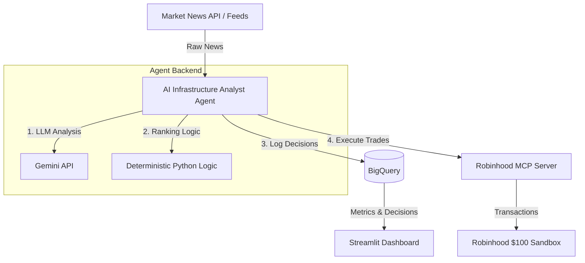

# AI Infrastructure Analyst

This repository contains the **AI Infrastructure Analyst**, an autonomous trading system built for a **Kaggle Capstone** project. The system integrates Google's Gemini models with deterministic Python logic to evaluate market news, rank key technology/AI assets, log trading decisions, execute transactions in a sandbox environment, and visualize performance.



---

## 🏗️ Project Architecture

The system consists of the following decoupled components:

1. **Market News Ingestion**: Automatically fetches real-time financial news and market updates.
2. **AI Infrastructure Analyst (Agent Backend)**:
   * **Gemini LLM**: Performs semantic analysis, sentiment evaluation, and hypothesis generation from the ingested news.
   * **Deterministic Python Logic**: Implements rigid risk management, constraints, and deterministic rules to rank and select trades.
3. **Target Assets**: The portfolio is strictly constrained to **10 specific assets**:
   * **9 AI/Tech Stocks**: Key drivers of the AI hardware and software infrastructure stack (e.g., NVDA, MSFT, GOOGL, AMZN, META, AVGO, TSLA, ASML, AMD).
   * **1 Treasury Hedge**: A safe-haven hedge asset (e.g., TLT or SHY) to manage system-wide market risk.
4. **Execution Layer**: Executes market decisions on a **$100 Robinhood sandbox** via a Model Context Protocol (MCP) server.
5. **Observability & Logging**: Persists all analytical outputs, agent prompts, and executed trades to **Google Cloud BigQuery** for auditing and model evaluation.
6. **Visualization**: A **Streamlit Dashboard** that reads historical trade logs and decisions from BigQuery to render real-time performance, portfolio allocations, and analytics.

---

## 🚦 Architectural Constraints & Agent Instructions

> [!IMPORTANT]
> **CRITICAL INSTRUCTIONS FOR ALL FUTURE AI AGENTS:**
> You must strictly adhere to the architectural constraints outlined in this document. Any modification to the core architecture (e.g., changing the asset universe, bypassing BigQuery, or altering the execution sandbox) requires an update to this section.

* **Asset Universe Constraint**: The agent must *only* trade or rank the 10 selected assets (9 AI stocks + 1 Treasury hedge). Do not add other equities or cryptocurrencies.
* **Sandbox Limit**: The execution layer must target the simulated Robinhood MCP sandbox, capped at a virtual starting capital of **$100**. Never route live funds or exceed this sandbox budget.
* **Deterministic Fallbacks**: Trading decisions must be filtered through deterministic Python logic after Gemini's analysis. An LLM must never have direct, unconstrained access to execute trades without validation rules.
* **Traceability**: Every transaction and ranking decision must be logged to BigQuery. Silent executions or bypasses are not permitted.
* **Documentation Rule**: If any core architectural decisions change during development, you **MUST** update this README to reflect the new state.

---

## 🤖 Automated / Headless Execution (Cron Job)

To run the agent automatically and headlessly on a daily cron job:
* **Persistent Session ID**: The agent uses OAuth 2.0 with PKCE for Robinhood MCP connection. To run headlessly without interactive login prompts, the agent relies on the persistent session's `refresh_token`.
* **Setup Flow**:
  1. Trigger the agent interactively **once** using a designated session ID (e.g., `daily-trading-session`) via the playground or a test script.
  2. Complete the OAuth login and consent process in the browser popup. The ADK framework will securely save the exchanged credentials (including the `refresh_token`) to that session's state database.
  3. Configure the daily cron job (e.g., Cloud Scheduler calling Cloud Run) to invoke the agent using the **exact same session ID** (`daily-trading-session`).
  4. The ADK runner will load the saved credentials, automatically refresh the access token if expired, and execute the run completely unattended.

---

## 🛠️ Getting Started

### Prerequisites
* Python 3.10+
* `uv` package manager installed
* Google Cloud CLI (`gcloud`) authenticated (for BigQuery access)

### Installation
1. Clone the repository and navigate to the project directory.
2. Create your `.env` file at the root:
   ```bash
   cp .env.example .env
   ```
3. Populate `.env` with your API keys:
   * `GEMINI_API_KEY`: Google AI Studio / Gemini API key.
   * `ROBINHOOD_MCP_URL`: Endpoint for your active Robinhood MCP server.

4. Install the agent dependencies:
   ```bash
   cd agent
   agents-cli install
   ```

5. Run the local agent playground:
   ```bash
   agents-cli playground
   ```

---

## 📅 Future / Deployment TODOs

* [ ] **Persistent Headless Auth for Daily Cron:**
  When deploying the agent to GCP Cloud Functions / Cloud Run for automated daily runs, we need to persist the dynamic Robinhood OAuth tokens:
  1. Save the local `~/.mcp-auth/config.json` to **GCP Secret Manager** (or GCS).
  2. In the serverless function handler, copy the secret JSON value to `/tmp/.mcp-auth/config.json` on startup.
  3. Set `os.environ["MCP_REMOTE_CONFIG_DIR"] = "/tmp/.mcp-auth"`.
  4. After the agent run finishes (which will silently trigger token refresh), read `/tmp/.mcp-auth/config.json` and save the new version back to Secret Manager to keep it valid for the next run.
