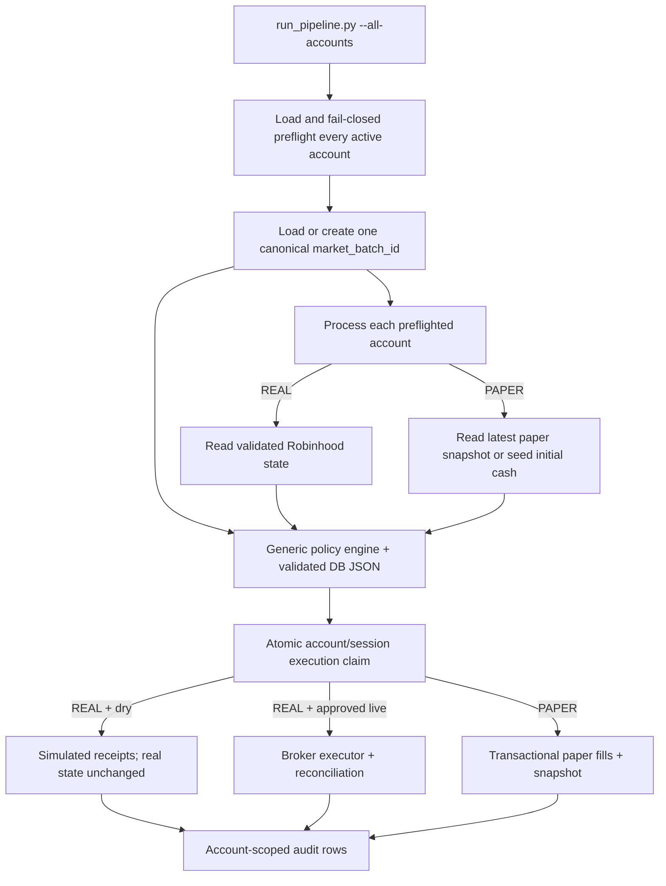

# Account-Scoped Experimentation and Policy Promotion Implementation Plan

Audience: a coding agent implementing persistent paper accounts, database-configured policy experiments, and future multi-account support without changing the existing dashboard's default real-account view.

Status: implemented and verified; no deployment performed.

Related backlog items: account-scoped execution safety, stable cron decisions, coherent simulation, and operational observability in `docs/backlog.md`.

This plan did not itself authorize a deployment, database migration, or live trading. The user subsequently authorized implementation and the additive BigQuery migration on 2026-07-21. No deployment occurred and every verification pipeline command explicitly used `SKIP_LIVE_TRADES=true`. The installed `--all-accounts --run-kind execution` cron interface is implemented. Promoting a policy to a real account or setting `SKIP_LIVE_TRADES=false` remains a separate explicit human action.

Implementation status (2026-07-21): complete for the initial account registry, shared paper ledger, ATR policy experiment, CLI/cron contract, dashboard isolation, migration, deterministic test plan, and consolidated Discord reporting. BigQuery contains `real-48661`, `exp-atr-immediate`, and `exp-atr-confirmation`; all have `live_execution_allowed=false`. Each paper account retains its verified `$30.00` META fill and has an auditable `PAPER_CAPITAL_ADJUSTMENT` snapshot with `$9,970.00` cash and exactly `$10,000.00` total equity. All-account runs send one Discord summary containing every registry account, its performance versus `initial_cash`, and combined performance. The user subsequently authorized activating both paper experiments without waiting for a frontend deployment and explicitly accepted the legacy dashboard risk. Both paper accounts are now `ACTIVE`, brokerless, and simulation-only. Full pytest result: 121 passed. The existing generic agents-cli eval harness remains unable to serialize the `ToolContext` parameter on `analyze_and_rank_portfolio`; this does not affect deterministic execution or the successful network-backed ADK integration tests.

Current operating contract: the installed `--all-accounts --run-kind execution` cron must retain `SKIP_LIVE_TRADES=true`. Active paper accounts mutate only their persistent simulated ledgers. The real account resolves to `REAL_DRY_RUN`, may record simulated recommendations/orders for comparison, and cannot submit a Robinhood order. Same-day finalized decisions are not replayed after capitalization; both paper accounts begin allocating their `$10,000` ledgers on the next eligible market-date execution.

## 1. Desired outcome

The system supports multiple named accounts in the existing BigQuery dataset:

- one or more `REAL` accounts backed by separately authorized broker identities;
- one or more `PAPER` accounts with no broker identity or broker access;
- a persistent cash, holdings, trade, execution, and risk-state history for every account;
- policy parameters stored as validated JSON in BigQuery;
- promotion of a tested policy configuration from a paper account to a real account without an account-specific Python branch;
- a dashboard that continues to show the existing real account unless a future account selector is deliberately added.

At the end of this plan:

1. Every account-bearing read and write is scoped by a stable `account_id`.
2. A paper account can never initialize Robinhood tools or submit a broker order.
3. `SKIP_LIVE_TRADES=false` plus a paper account fails during preflight before ingestion, portfolio reads, or tool initialization.
4. Paper fills update a persistent paper portfolio rather than re-reading Robinhood on the next run.
5. Two accounts can apply different policy JSON to the same market-data batch without `if account_id == ...` logic.
6. The policy JSON and its canonical hash are copied into every execution audit.
7. Existing real snapshots and real fills remain the default UI data.
8. The same schema can later support additional explicitly authorized real accounts.
9. One cron process ingests market data once and processes every active account against the same market batch.

## 2. Non-goals

This work does not:

- enable live trading;
- add another real Robinhood account;
- modify broker credentials or store credentials in BigQuery;
- decide that the two-close ATR experiment is superior;
- build the complete historical walk-forward/backtest engine;
- add a dashboard account selector now;
- permit arbitrary executable code, import paths, or Python class names in policy JSON;
- make BigQuery account rows sufficient authorization for a new live broker account.

## 3. Current-state findings that drive the design

The implementation must account for these current behaviors:

1. `run_pipeline.py` has no CLI account selector and calls one combined ingestion, decision, execution, and logging pipeline.
2. `financial_analysis_pipeline()` always resolves `ROBINHOOD_ACCOUNT_NUMBER`, always fetches Robinhood state, and derives dry-run behavior directly from `SKIP_LIVE_TRADES`.
3. Dry-run trades are appended to `trade_history`, but the simulated cash and holdings are discarded. The next run reads the unchanged Robinhood portfolio.
4. `ValidatedExecutionPlan` carries a broker account number but no logical `account_id`, account type, or policy-configuration hash.
5. The deterministic policy authorizes only account numbers ending in `48661`.
6. `BrokerExecutor` independently reads `SKIP_LIVE_TRADES`; therefore execution mode is not currently a validated property of the plan.
7. Duplicate-run checks use `decision_id + dry_run`, and current decision IDs include the broker suffix and policy version. Changing policy version could therefore bypass same-day idempotency.
8. `position_risk_state` is keyed by broker suffix and ticker, so paper accounts and future real accounts cannot maintain independent stop state.
9. `portfolio_snapshot` has no `dry_run` or account filter. The dashboard selects the newest row globally.
10. The dashboard trade log hides `dry_run=true` rows by default, but its initial query is not account-scoped.
11. `infrastructure_market_metrics` mixes shared market observations with account-specific final signals and target weights. Repeating those rows for multiple accounts without an explicit record scope would corrupt sentiment-history calculations.
12. BigQuery does not enforce primary keys or foreign keys in the current schema. Application-level validation, deterministic IDs, and atomic claims are required.

## 4. Fixed design decisions

These decisions remove ambiguity for the implementing agent.

### 4.1 One new table, shared existing ledgers

Create one new `accounts` registry. Continue using the existing tables for trades, snapshots, executions, risk state, and market metrics. Add account/run fields to those tables rather than creating separate paper tables.

### 4.2 Account identity is not strategy behavior

Never write logic such as:

```python
if account_id == "exp-atr-confirmation":
    confirmation_closes = 2
```

The pipeline resolves an account, validates its policy JSON, and passes a typed configuration to a generic policy engine:

```text
account_id -> accounts.policy_config -> strict Python schema -> policy evaluation
```

### 4.3 Policy JSON lives in BigQuery

BigQuery stores supported strategy parameters. Python defines and validates their meaning. Initial examples are:

```json
{
  "atr_period": 14,
  "atr_multiplier": 3.0,
  "atr_confirmation_closes": 1,
  "cancel_pending_exit_on_recovery": false
}
```

and:

```json
{
  "atr_period": 14,
  "atr_multiplier": 3.0,
  "atr_confirmation_closes": 2,
  "cancel_pending_exit_on_recovery": true
}
```

The JSON may select only implemented, allowlisted behavior. It may not contain a module path, class name, expression, callback, SQL fragment, or code.

### 4.4 Promotion copies policy, not account identity

Do not convert a paper account into a real account. Preserve its simulated history. Promotion means assigning the tested `policy_name`, `policy_version`, and `policy_config` to an already-authorized real account through a reviewed database change. The real account then generates its own execution history.

### 4.5 Execution mode is derived and validated once

Parse `SKIP_LIVE_TRADES` strictly during preflight and derive an immutable execution mode:

| Account type | `SKIP_LIVE_TRADES` | Effective behavior |
|---|---:|---|
| `PAPER` | `true` | Persistent paper simulation |
| `PAPER` | `false` | Fatal preflight error |
| `REAL` | `true` | Read-only broker state plus simulated/advisory execution; never mutate paper state |
| `REAL` | `false` | Live only after every registry, allowlist, environment, broker-identity, and kill-switch check passes |

`SKIP_LIVE_TRADES=true` may always reduce capability. `SKIP_LIVE_TRADES=false` must never increase a paper account's capability.

### 4.6 Paper accounts have no broker binding

For `PAPER` rows:

- `broker_provider`, `broker_account_ref`, and `broker_account_suffix` must be null;
- `live_execution_allowed` must be false;
- Robinhood MCP tools must not be constructed, listed, queried, or passed into an executor;
- paper quotes come from the validated market-data adapter, not Robinhood.

### 4.7 Multiple real accounts remain possible but separately authorized

The schema may contain multiple `REAL` rows. Each requires an external secret reference and an explicit code/config allowlist entry. A BigQuery insert or update alone cannot authorize live trading. The current `48661` protection remains until a separately approved multi-real-account change replaces it.

### 4.8 Existing UI remains pinned to the primary real account

Before any paper snapshot can be written, every dashboard query that reads account-bearing data must resolve exactly one active `is_dashboard_default=true` real account and filter by its `account_id`. Zero or multiple defaults produce a visible dashboard error; the UI must never fall back to the globally newest row.

### 4.9 Market inputs and account decisions share a table but not a scope

Keep `infrastructure_market_metrics`, but distinguish:

- `MARKET_INPUT`: one canonical observation per ticker and market-data batch; `account_id` and account-specific target weights are null;
- `ACCOUNT_DECISION`: one account's final signal, thesis, and target weight for that same batch; `account_id` and `decision_id` are required;
- `LEGACY_COMBINED`: migrated historical rows that cannot be separated retrospectively.

Historical EWMA/volatility queries use `MARKET_INPUT` plus documented legacy rows only. They must never count duplicated `ACCOUNT_DECISION` rows from multiple accounts.

## 5. Target data model

### 5.1 New `accounts` table

Use an additive BigQuery table with this logical schema:

| Field | Type | Required behavior |
|---|---|---|
| `account_id` | STRING | Stable lowercase slug; immutable application identifier |
| `display_name` | STRING | Friendly UI/log name; may change |
| `account_type` | STRING | `REAL` or `PAPER` |
| `status` | STRING | `ACTIVE`, `PAUSED`, or `ARCHIVED` |
| `is_dashboard_default` | BOOLEAN | Exactly one active real account is true during the initial rollout |
| `broker_provider` | STRING | `ROBINHOOD` for configured real accounts; null for paper |
| `broker_account_ref` | STRING | Reference to external secret/config only; never credentials or full account number |
| `broker_account_suffix` | STRING | Masked identity check; null for paper |
| `live_execution_allowed` | BOOLEAN | Must be false for paper; false for all rows during implementation |
| `initial_cash` | FLOAT | Positive finite seed used only when a paper account has no snapshots |
| `base_currency` | STRING | Initially `USD` |
| `policy_name` | STRING | Friendly stable policy family name |
| `policy_version` | STRING | Version of the supported policy schema/behavior |
| `policy_config` | JSON | Strictly validated parameters |
| `policy_config_hash` | STRING | SHA-256 of canonical JSON; verified at read time |
| `created_at` | TIMESTAMP | Audit timestamp |
| `updated_at` | TIMESTAMP | Audit timestamp |

Application invariants:

- `account_id` matches `^[a-z0-9][a-z0-9-]{0,62}$`.
- Account lookup returns exactly one row.
- Paper accounts have no broker fields and cannot be live-enabled.
- Real accounts require broker metadata before live eligibility, but broker secrets remain outside BigQuery.
- Initial cash is used exactly once to create the first paper snapshot.
- Policy JSON hash is recomputed after parsing canonical JSON; a mismatch cancels the run.
- Unknown account types, statuses, policy versions, or JSON keys cancel the run.

Initial rows should be reviewed explicitly. Suggested IDs:

```text
real-48661             Robinhood $100                 REAL
legacy-real-shadow     Legacy Robinhood Dry Runs      PAPER/ARCHIVED
exp-atr-immediate      ATR Immediate Exit             PAPER
exp-atr-confirmation   ATR Two-Close Confirmation     PAPER
```

Do not seed experimental rows as active until the paper-ledger implementation and UI isolation tests pass.

### 5.2 `trade_history` additions

Add nullable fields first, then make them mandatory in application writes:

| Field | Purpose |
|---|---|
| `account_id` | Joins the fill to `accounts` |
| `trade_id` | Deterministic idempotency key, derived from decision/ticker/side/sequence |
| `execution_mode` | `LIVE`, `REAL_DRY_RUN`, or `PAPER` |
| `fill_price` | Exact broker fill or deterministic paper fill |
| `fees_usd` | Explicit costs; zero only when the configured model says zero |
| `slippage_usd` | Explicit paper/live execution attribution |
| `market_batch_id` | Point-in-time input batch used by the decision |

Retain `dry_run` for backward compatibility and UI semantics. It must agree with `execution_mode`:

- `LIVE` -> `dry_run=false`;
- `REAL_DRY_RUN` or `PAPER` -> `dry_run=true`.

Every new query for recent trades, sold-ticker cooldowns, or last-buy timestamps must require `account_id`. A paper sell must never put a ticker on a real account's cooldown list.

### 5.3 `portfolio_snapshot` additions

Add:

| Field | Purpose |
|---|---|
| `account_id` | Account-scoped portfolio state |
| `snapshot_id` | Deterministic unique application key |
| `snapshot_type` | `BROKER_CONFIRMED`, `REAL_READ_ONLY`, `PAPER_COMMITTED`, or `PAPER_SEED` |
| `decision_id` | Decision that produced the snapshot, when applicable |
| `market_batch_id` | Valuation batch |
| `policy_config_hash` | Policy attribution |

The legacy required `account_number` column must never become an authorization source. Until it can be relaxed safely, paper rows may use a non-broker display marker such as `PAPER`; `account_id` remains authoritative.

The holdings JSON remains the portfolio checkpoint in this implementation. Define and validate its schema explicitly:

```json
[
  {
    "symbol": "MU",
    "shares": 0.024291,
    "average_buy_price": 1048.51,
    "current_price": 967.68,
    "equity": 23.51
  }
]
```

All quantities and monetary values must be finite and non-negative. Symbols must pass the existing allowlist.

### 5.4 `execution_runs` additions

Add:

| Field | Purpose |
|---|---|
| `account_id` | Account-scoped run identity |
| `run_kind` | `ADVISORY` or `EXECUTION` |
| `market_date` | New York market date |
| `execution_window` | Stable name such as `close` |
| `market_batch_id` | Inputs consumed |
| `execution_mode` | Derived immutable mode |
| `requested_live` | Parsed operator request for audit |
| `policy_name` | Policy family |
| `policy_config` | Exact effective JSON snapshot |
| `policy_config_hash` | Canonical hash |

Replace the check-then-insert race with an atomic account-scoped claim. The stable executable identity is:

```text
(account_id, market_date, execution_window, run_kind=EXECUTION)
```

Do not include policy version or configuration hash in the uniqueness identity. Updating policy configuration must not create a second executable decision for the same account and market session.

Suggested decision ID:

```text
2026-07-21-close-exp-atr-confirmation
```

Advisory scans may have separate scan IDs but may not insert trades, update paper positions, update risk-state transitions, or claim the execution window.

### 5.5 `position_risk_state` additions

Add `account_id` and stop using `account_suffix` as the logical key. Also add a position-generation key so a later re-entry cannot inherit a prior position's breached stop:

| Field | Purpose |
|---|---|
| `account_id` | Account isolation |
| `position_id` | Deterministic account/ticker/entry-generation identifier |
| `exit_state` | `ACTIVE`, `EXIT_PENDING`, `EXIT_CONFIRMED`, or `CLOSED` |
| `first_breach_session` | First completed close below the previous stop |
| `consecutive_breach_closes` | Confirmation count |
| `recovery_session` | Completed close that cancelled a pending breach |
| `policy_config_hash` | Policy under which state was calculated |

Key stop state by `(account_id, position_id)`, not only ticker. A full exit closes the state. A subsequent entry creates a new position ID and fresh stop path.

### 5.6 `infrastructure_market_metrics` additions

Add:

| Field | Purpose |
|---|---|
| `market_batch_id` | Shared point-in-time market-data batch |
| `record_scope` | `MARKET_INPUT`, `ACCOUNT_DECISION`, or `LEGACY_COMBINED` |
| `account_id` | Required only for `ACCOUNT_DECISION` |
| `decision_id` | Required only for `ACCOUNT_DECISION` |

Refactor logging so ingestion persists canonical market rows before account evaluation. Account evaluation may then persist account-specific decision rows without contaminating historical sentiment inputs.

## 6. Runtime architecture



### 6.1 Account domain module

Add a focused module such as `agent/app/accounts.py` containing:

- `AccountType`, `AccountStatus`, and `ExecutionMode` enums;
- immutable `AccountConfig` and strict `StrategyConfig` models;
- canonical JSON hashing;
- account invariant validation;
- execution-mode resolution;
- no BigQuery client code and no broker code.

Add BigQuery adapters to `bigquery_service.py`:

- `get_account(account_id)`;
- `list_accounts(...)` for CLI/UI use;
- `get_default_dashboard_account()`;
- account-scoped snapshot/trade/risk/run functions.

### 6.2 State and execution adapters

Avoid account-ID branches by selecting an adapter from `account_type` once:

```text
REAL  -> BrokerPortfolioProvider + BrokerExecutor/RealDryExecutor
PAPER -> PaperPortfolioProvider + PaperExecutor
```

Both providers return the same validated `PortfolioState` type. Both executors accept the same validated plan and emit the same receipt/result types. `PaperExecutor` must not accept a toolset or broker account number in its constructor.

Account-type routing is allowed. Account-ID routing is not.

### 6.3 Paper account initialization

When loading a paper account:

1. Query the newest committed snapshot for `account_id`.
2. If one exists, validate every field and continue from it.
3. If none exists, verify there are also no paper trades or execution runs for that account.
4. Validate `initial_cash` and create one deterministic `PAPER_SEED` snapshot with empty holdings.
5. If snapshots are absent but trades/runs exist, fail with `PAPER_LEDGER_INCOMPLETE`; never reseed and erase history.

Do not initialize a paper account from Robinhood automatically. A future explicit import operation may copy a reviewed real snapshot, but that is outside this plan.

### 6.4 Paper fills and portfolio updates

For a validated paper order:

- use an input quote with a recorded observation time;
- reject stale, missing, zero, negative, non-finite, or crossed prices using the same strictness as real execution;
- apply configured spread/slippage and fees deterministically;
- prevent negative cash and negative shares;
- update fractional quantity and weighted average cost;
- retain the sell-first/buy-later-market-date rule;
- append deterministic trade receipts;
- write the resulting `PAPER_COMMITTED` snapshot.

Use one BigQuery multi-statement transaction or equivalent single atomic repository operation for the paper trade rows, final snapshot, and execution status. A failed commit produces no paper fills and no new snapshot.

Each trade has a deterministic `trade_id`. Each snapshot has a deterministic `snapshot_id`. A retry must converge on the same rows without duplication.

### 6.5 Policy configuration and ATR confirmation

The initial strict schema should include only already understood parameters. Suggested bounds:

| Parameter | Type | Initial bounds/default |
|---|---|---|
| `atr_period` | integer | 5–100; default 14 |
| `atr_multiplier` | number | 0.5–10.0; default 3.0 |
| `atr_confirmation_closes` | integer | 1–5; default 1 |
| `cancel_pending_exit_on_recovery` | boolean | default false for current behavior |

Keep all other P0 thresholds fixed until they are intentionally parameterized and tested.

ATR state behavior:

- confirmation count `1`: first completed breach moves directly to `EXIT_CONFIRMED`, preserving current behavior;
- confirmation count greater than `1`: first breach moves to `EXIT_PENDING`;
- another completed close below the applicable prior stop increments the count;
- reaching the configured count moves to `EXIT_CONFIRMED`;
- if recovery cancellation is enabled, a completed close above or equal to the applicable stop before confirmation returns state to `ACTIVE` and records the recovery;
- intraday quotes never increment or cancel completed-close confirmation state;
- a confirmed exit remains confirmed until the position is closed;
- positive sentiment cannot by itself cancel a confirmed hard-risk exit;
- a new entry uses a new `position_id` and fresh stop state.

The MU July 20–21 sequence must become a deterministic regression fixture for both policy configurations.

### 6.6 CLI and cron contract

Support mutually exclusive account selectors:

```bash
uv run run_pipeline.py --account real-48661
uv run run_pipeline.py --all-accounts
```

Normal cron uses `--all-accounts`. The single-account form remains useful for manual diagnostics and recovery. Omitting both selectors or supplying both is an error.

Also support:

```bash
uv run run_pipeline.py --list-accounts
```

The list output includes account ID, friendly name, type, status, policy name/version, and whether it is live-eligible. It must not print broker secrets or full account numbers.

Add an explicit run kind:

```bash
uv run run_pipeline.py --account exp-atr-confirmation --run-kind advisory
uv run run_pipeline.py --account exp-atr-confirmation --run-kind execution
```

Recommended eventual schedule:

- one 13:20 Pacific execution invocation, because the current completed-bar cutoff is 16:15 New York time;
- ingest or load one canonical market batch;
- preflight all selected accounts before processing any of them;
- process accounts sequentially with an independent execution run/status for each account;
- continue to later accounts after an account-local state/policy failure, but return a non-zero aggregate exit status and report every failure;
- abort the entire invocation before account processing for registry-wide, schema, market-data, or contradictory execution-mode failures.

The user has already installed this cron entry, which is the required compatibility target:

```cron
PATH=/opt/homebrew/bin:/usr/local/bin:/usr/bin:/bin
20 13 * * 1-5 mkdir -p /tmp/stock-trader && cd /Users/sagar/Documents/ML/stock-trader/agent && SKIP_LIVE_TRADES=true uv run run_pipeline.py --all-accounts --run-kind execution > /tmp/stock-trader/$(date +\%A_\%H_\%M).log 2>&1
```

Until CLI implementation, Python ignores the two new arguments and executes the existing single real-account dry-run path. `SKIP_LIVE_TRADES=true` remains the active safety boundary during this compatibility interval.

### 6.7 UI contract

Before enabling paper writes:

1. Resolve the single active default dashboard account from `accounts`.
2. Filter `load_latest_snapshot()` by that account.
3. Filter `load_portfolio_history()` by that account before the daily `ROW_NUMBER()` operation.
4. Filter `load_trade_history()` by that account; retain the existing `dry_run` toggle.
5. Filter account-specific recommendation rows by that account while reading shared news/graveyard data from the canonical market batch.
6. Display the registry `display_name`; retain masked broker identity only as secondary metadata.
7. If the default account is missing, duplicated, paused, or not real, show a blocking data error rather than the newest global row.

The initial UI must not expose a paper selector. A later selector can reuse the same account-scoped queries.

## 7. Fail-closed error matrix

Every condition below needs a stable reason code, zero broker orders when applicable, and a deterministic test.

### 7.1 Account and configuration preflight

| Condition | Required result |
|---|---|
| Neither `--account` nor `--all-accounts` supplied | Exit non-zero before setup/ingestion |
| Both account selectors supplied | `ACCOUNT_SELECTION_INVALID`; cancel |
| `--all-accounts` resolves no active accounts | `NO_ACTIVE_ACCOUNTS`; cancel |
| Unknown account | `ACCOUNT_NOT_FOUND`; no tools or writes except optional failure audit |
| Duplicate account rows | `ACCOUNT_NOT_UNIQUE`; cancel |
| Paused or archived account | `ACCOUNT_INACTIVE`; cancel |
| Invalid account ID/display/type | `ACCOUNT_CONFIG_INVALID`; cancel |
| Missing/malformed policy JSON | `POLICY_CONFIG_INVALID`; cancel |
| Unknown JSON field or policy version | `POLICY_CONFIG_UNSUPPORTED`; cancel |
| Config hash mismatch | `POLICY_CONFIG_HASH_MISMATCH`; cancel |
| Accounts table unavailable | `ACCOUNT_REGISTRY_UNAVAILABLE`; cancel |
| Paper account contains broker metadata | `PAPER_BROKER_BINDING_FORBIDDEN`; cancel |
| Paper account is live-enabled | `PAPER_LIVE_ENABLE_FORBIDDEN`; cancel |
| Paper plus `SKIP_LIVE_TRADES=false` | `PAPER_ACCOUNT_LIVE_EXECUTION_FORBIDDEN`; exit before tool initialization |
| `--all-accounts` plus `SKIP_LIVE_TRADES=false` selects any paper account | Reject the entire invocation during set preflight before processing a real account |
| Real account lacks broker reference | `BROKER_ACCOUNT_UNCONFIGURED`; cancel live request |
| Real broker identity does not match registry/allowlist | `BROKER_ACCOUNT_MISMATCH`; cancel |
| `SKIP_LIVE_TRADES` has a value other than strict true/false | `EXECUTION_MODE_INVALID`; cancel |

### 7.2 State and market data

| Condition | Required result |
|---|---|
| Paper account has no history | Create exactly one seed snapshot |
| Paper trades exist without a snapshot | `PAPER_LEDGER_INCOMPLETE`; do not reseed |
| Snapshot JSON malformed | `PORTFOLIO_STATE_INVALID`; cancel |
| Duplicate latest snapshots with conflicting state | `PORTFOLIO_STATE_AMBIGUOUS`; cancel |
| Negative/non-finite cash, shares, cost, or equity | `PORTFOLIO_STATE_INVALID`; cancel |
| Holding ticker outside allowlist | `UNKNOWN_TICKER`; cancel |
| Missing/stale market batch | `MARKET_DATA_UNAVAILABLE` or `STALE_MARKET_METRICS`; cancel |
| Account decision references another account's state | `ACCOUNT_SCOPE_MISMATCH`; cancel |
| Risk state belongs to another account/position generation | `RISK_STATE_SCOPE_MISMATCH`; cancel |
| Current incomplete bar presented as completed | Reject input; do not advance confirmation state |

### 7.3 Idempotency, concurrency, and partial failure

| Condition | Required result |
|---|---|
| Same account/window cron retry | Existing claim wins; zero additional trades |
| Two concurrent processes claim same account/window | Exactly one execution claim succeeds |
| Same market date but different paper accounts | Independent claims and ledgers |
| Policy config changes after an account/window executed | No second execution for that window |
| Crash before execution claim | Safe retry |
| Crash after claim but before any execution | Run remains recoverable/aborted; no fills |
| Paper transaction fails before commit | No trades, no snapshot, failed run status |
| Process dies after paper transaction commits | Retry discovers deterministic trade/snapshot IDs and does not duplicate |
| Broker response uncertain | Preserve existing fail-closed reconciliation behavior |
| Execution audit write fails before broker submission | No broker submission |
| Post-live audit write fails after confirmed broker fill | Reconcile broker state and raise critical alert; never replay order blindly |

### 7.4 UI and reporting

| Condition | Required result |
|---|---|
| Paper snapshot is newer than real snapshot | Existing UI still shows the real account |
| Paper fill is newer than real fill | Existing UI default trade log still shows only selected real account |
| Multiple dashboard defaults | Visible blocking error; no arbitrary selection |
| Account label contains HTML/control characters | Sanitize before display/logging |
| Discord/report for paper run | Clearly labeled with friendly name and `PAPER`; never “LIVE EXECUTION” |
| All-account cron report | One message includes all registry accounts, paused/run status, per-account P&L, and combined P&L |
| Generic ATR/SPY override | Report exact per-ticker reason codes and stop state |

## 8. Migration and implementation phases

Complete phases in order. Keep paper accounts disabled until Phase 7 verification passes.

### Phase 0: Baseline and migration inventory

1. Run `agents-cli info` and record the existing project configuration.
2. Run the full deterministic test suite and record the count.
3. Capture read-only row counts and null distributions for all affected tables.
4. Identify existing live versus dry-run rows and the current default real snapshot history.
5. Export or otherwise document a recoverable schema/data backup procedure.
6. Confirm `SKIP_LIVE_TRADES=true` and the trading kill switch state.

Exit criteria:

- baseline tests pass;
- legacy backfill rules have expected row counts;
- no schema or data mutation has occurred yet.

### Phase 1: Pure account and strategy models

1. Implement strict account/config models and canonical hashing.
2. Implement the execution-mode matrix as a pure function.
3. Parameterize only the approved ATR settings.
4. Preserve current behavior under the default immediate-exit configuration.
5. Add the pending/confirmed/recovered stop-state calculation as pure deterministic logic.

Exit criteria:

- unit tests cover every config boundary and execution-mode combination;
- current `p0-v1` fixtures remain unchanged under default JSON;
- MU recovery fixtures distinguish immediate and two-close configurations.

### Phase 2: Additive BigQuery schema and migration tooling

1. Add the `accounts` table.
2. Add nullable account/run fields to existing tables.
3. Write explicit, idempotent backfill SQL or a migration command; do not hide destructive migration inside normal cron startup.
4. Seed only the reviewed real and archived legacy account rows initially.
5. Backfill:
   - broker-confirmed snapshots and live trades to `real-48661`;
   - legacy simulated trades/execution runs to `legacy-real-shadow`;
   - existing risk state for suffix `48661` to `real-48661`;
   - existing combined market rows to `LEGACY_COMBINED` with the real account attribution needed to preserve the current UI.
6. Run integrity queries proving no affected row is unassigned or multiply assigned.

Do not turn new columns into BigQuery `REQUIRED` fields during the initial additive migration. Enforce requiredness in application models/writers first; legacy data and BigQuery schema evolution make an immediate non-null constraint unsafe.

Exit criteria:

- migration can be rerun without changing counts;
- every legacy row has a documented account/scope mapping;
- no active paper account exists;
- current UI still returns the same real-account values.

### Phase 3: Account-scoped repositories and atomic run claim

1. Require `account_id` in all new trade/snapshot/run/risk repository calls.
2. Add account filters to every relevant read.
3. Implement atomic execution-window claiming.
4. Include account and policy snapshots in execution audit rows.
5. Add deterministic `trade_id` and `snapshot_id` generation.
6. Update sold-ticker cooldown and holding-age queries to use account scope.
7. Separate canonical market-input queries from account-decision queries.

Exit criteria:

- repository tests inspect SQL parameters and prove account filters are present;
- cross-account fixtures return no data;
- concurrent claim integration test produces one winner.

### Phase 4: Pipeline CLI and preflight

1. Add mutually exclusive `--account`/`--all-accounts` selectors and required `--run-kind` parsing while preserving the installed cron syntax exactly.
2. Add `--list-accounts` with redacted output.
3. Resolve and validate the complete selected account set before BigQuery setup side effects, ingestion, ADK sessions, or Robinhood tool initialization.
4. Ingest/load one market batch, then process all selected accounts sequentially against it.
5. Thread immutable account context, market batch ID, execution mode, and policy hash through each account run.
6. Give every account an independent execution status while returning a non-zero aggregate process status if any account fails.
7. Include friendly account names and IDs in structured log sections/report metadata without using them as filesystem paths unsafely.

Exit criteria:

- every invalid preflight exits non-zero and proves no broker/tool call;
- an account ID is visible in every structured run artifact;
- no function re-reads `SKIP_LIVE_TRADES` after preflight.
- all accounts in one invocation consume the same market batch and cannot mutate each other's state.

### Phase 5: Execution adapters and persistent paper ledger

1. Define a shared portfolio provider/executor interface.
2. Adapt current broker behavior without weakening existing validations.
3. Implement paper state loading, one-time seeding, quote validation, fills, costs, and portfolio math.
4. Commit paper trades/snapshot/status atomically.
5. Ensure paper execution cannot import or receive Robinhood tools.
6. Keep real dry-run simulations non-persistent with respect to real holdings.

Exit criteria:

- a paper sell removes the position from the next paper run;
- a real dry run leaves both broker and paper ledgers unchanged;
- paper/live mode-conflict tests pass;
- injected transaction failures leave no partial paper state.

### Phase 6: Account-aware risk state and policy experiments

1. Key stop state by account and position generation.
2. Wire validated policy JSON into ATR calculation and confirmation transitions.
3. Snapshot effective JSON/hash into every run.
4. Seed `exp-atr-immediate` and `exp-atr-confirmation` only after repository/executor tests pass.
5. Run both experiments from identical point-in-time market batches.

Exit criteria:

- the two accounts can diverge only because of their recorded policy configuration/state;
- no account-specific Python condition exists;
- identical config/state/input produces identical output across accounts.

### Phase 7: Dashboard isolation

1. Add account registry lookup and default-real validation.
2. Account-scope snapshots, performance, trades, and account-decision recommendations.
3. Retain the existing real-only default behavior and dry-run toggle.
4. Add tests or query-contract checks proving newer paper rows cannot appear.
5. Deploying the UI remains a separate explicit approval.

Exit criteria:

- all displayed holdings, equity, performance, and default trades belong to `real-48661`;
- a synthetic newer paper row does not change any default UI result;
- no global-latest account-bearing query remains.

### Phase 8: Operational rollout and cron handoff

1. Run paper accounts manually with `SKIP_LIVE_TRADES=true` using both single-account and all-account modes.
2. Verify account-specific log sections, snapshots, decisions, and idempotency.
3. Run at least one retry and one injected account-local failure proving later accounts still run and the aggregate status fails.
4. Verify the already-installed 13:20 `--all-accounts --run-kind execution` cron command works unchanged.
5. Confirm the invocation ingests once and all accounts consume the same market batch.

Exit criteria:

- paper runs persist coherent state over multiple market dates;
- current UI remains unchanged;
- the installed cron is compatible with the implemented CLI and produces one combined, account-labeled log;
- `SKIP_LIVE_TRADES` remains true.

### Phase 9: Evaluation and promotion gate

1. Use the coherent ledger to compare immediate ATR exit and two-close confirmation on identical point-in-time inputs.
2. Include spread, slippage, fees, fractional constraints, and rejected fills.
3. Report total return, drawdown, Sharpe/Sortino, turnover, exposure, and SPY/technology benchmark comparisons.
4. Define minimum out-of-sample evidence before promotion.
5. If promotion is approved, copy the exact tested JSON/hash to the real account; do not mutate the paper account.
6. Treat any real policy update and all live enablement as separate human-approved operations.

## 9. Test plan

### 9.1 New unit-test modules

Prefer focused files:

| File | Coverage |
|---|---|
| `agent/tests/unit/test_accounts.py` | Account invariants, JSON validation/hash, execution-mode matrix |
| `agent/tests/unit/test_paper_executor.py` | Persistent paper math, fills, costs, idempotency, invalid state |
| `agent/tests/unit/test_account_repository.py` | Account-scoped SQL, default account, redaction, backfill contracts |
| `agent/tests/unit/test_risk_controls.py` | Immediate/pending/confirmed/recovered ATR transitions |
| `agent/tests/unit/test_trading_policy.py` | Config-driven policy outcomes and account scope |
| `agent/tests/unit/test_robinhood_execution.py` | Defense-in-depth rejection of paper plans and multi-real identity checks |
| `agent/tests/unit/test_pipeline_cli.py` | Required args, list output, preflight ordering, exit codes |

### 9.2 Account/config unit matrix

Cover at least:

1. Valid real and paper rows.
2. Unknown/duplicate/inactive account.
3. Invalid account slug and unsafe display text.
4. Paper row with any broker field.
5. Paper row with `live_execution_allowed=true`.
6. Real row missing broker metadata.
7. Strict true/false parsing for `SKIP_LIVE_TRADES`.
8. Every account-type/execution-mode combination.
9. Missing, malformed, non-object, or oversized policy JSON.
10. Unknown key with Pydantic `extra=forbid`.
11. Boundary values for ATR period, multiplier, and confirmations.
12. Canonical hash stability across JSON key order.
13. Hash mismatch rejection.
14. Same policy JSON attached to different accounts produces the same typed configuration.
15. `--account` and `--all-accounts` are mutually exclusive and one is required.
16. All-account selection is deterministic, excludes paused/archived rows, and rejects an empty set.

### 9.3 Paper ledger unit matrix

Cover at least:

1. First-run seed from initial cash.
2. Repeated seed is idempotent.
3. Missing snapshot plus existing trades fails.
4. Buy reduces cash and creates fractional holdings/cost basis.
5. Add updates weighted average cost.
6. Partial reduce preserves remaining cost basis.
7. Full exit removes holding and realizes the configured result.
8. Sell larger than position fails.
9. Buy beyond available cash/reserve fails.
10. Missing/stale/invalid quotes fail before writes.
11. Spread, slippage, and fee math is deterministic.
12. Same decision retry produces no duplicate fill/snapshot.
13. Cross-account trade/snapshot reads return nothing.
14. Transaction failure before commit leaves zero new rows.
15. Retry after a simulated post-commit process death discovers committed state.

### 9.4 Policy/risk regression matrix

Cover at least:

1. Current immediate policy confirms on the first completed close below stop.
2. Two-close policy enters `EXIT_PENDING` after one breach.
3. Second consecutive breach confirms exit.
4. Completed recovery above/equal stop cancels pending state when enabled.
5. Recovery does not cancel when disabled.
6. Intraday recovery does not alter completed-close state.
7. Confirmed exit remains confirmed until the position closes.
8. Re-entry creates new position state.
9. MU July 20 close `$865.46`, stop `$966.40`, and July 21 close `$967.68`:
   - immediate account remains confirmed;
   - two-close/recovery account returns active.
10. MRVL/SNDK fixtures cover recovery and continued-breach variants.
11. Positive sentiment cannot override a confirmed hard exit.
12. Same market batch plus same JSON yields identical decisions across account IDs.

### 9.5 Execution safety matrix

Prove, with mocks that fail the test if touched:

1. Paper plus `SKIP_LIVE_TRADES=false` errors before `get_tools()`.
2. Paper dry run never calls any Robinhood function.
3. Paper executor cannot be constructed with a broker toolset.
4. A forged paper plan reaching `BrokerExecutor` is rejected.
5. Real dry run never calls `place_equity_order`.
6. Real live request fails when registry permission is false.
7. Real live request fails when suffix/secret-resolved identity differs.
8. Accounts-registry outage fails before broker state fetch.
9. Kill switch still overrides every real live authorization.
10. Existing ticker/account/order-cap/reconciliation tests remain green.

### 9.6 BigQuery migration and repository integration tests

Use a disposable dataset or emulator-compatible repository boundary where practical. Verify:

1. Additive schema migration preserves existing rows.
2. Backfill row counts match pre-migration counts.
3. Backfill can run twice without changing results.
4. Live rows, dry rows, snapshots, and risk state map to the intended accounts.
5. No new account-bearing writer accepts a missing account ID.
6. Account filters appear in every relevant query.
7. Market-input history excludes duplicated account-decision rows.
8. Two accounts can use the same market batch without duplicate EWMA inputs.
9. Atomic claim allows one concurrent winner.
10. Paper transaction writes fills/snapshot/status together.
11. Execution run stores exact policy JSON and matching hash.
12. Config changes do not permit a second same-session execution.

### 9.7 Pipeline integration scenarios

Run end-to-end with all external systems mocked:

1. Active paper account, empty history, valid market data: seed and execute.
2. Second paper run starts from prior simulated state.
3. Immediate and confirmation accounts diverge on the MU fixture.
4. One paper account failure does not mutate another account.
5. Real dry-run account reads broker state but does not persist simulated portfolio changes.
6. Advisory run creates no trade, snapshot transition, or execution claim.
7. Execution retry creates no duplicate orders.
8. Unknown/paused/config-invalid account exits before ADK session creation.
9. Account-specific recent trades and holding age are isolated.
10. Paper account never triggers the live sold-ticker cooldown for a real account.
11. All-account mode ingests once and passes one `market_batch_id` to every account.
12. An account-local failure is audited, later accounts still run, and the aggregate process exits non-zero.
13. A registry-wide or market-batch failure processes zero accounts.

### 9.8 Frontend query-contract tests

At minimum, test query construction or factor data access into testable helpers. Fixtures should include a newer paper row than the real row.

Verify:

1. Latest snapshot is selected within the default real account.
2. Portfolio history partitions within the selected account.
3. Trade history filters the selected account before applying the dry-run toggle.
4. Account-decision recommendations use the selected account and canonical batch.
5. News/graveyard views do not multiply rows across account decisions.
6. Missing or duplicate default account produces an error, not arbitrary data.
7. Friendly display name is sanitized and rendered.

### 9.9 ADK evaluation boundary

Do not use LLM output assertions to prove account isolation, policy authorization, idempotency, or portfolio math. Those are deterministic `pytest` and integration-test contracts.

Before running any ADK evaluation during implementation, read the `google-agents-cli-eval` skill. Use ADK eval only if prompts or agent-visible context change materially, for example to assess whether explanations accurately distinguish `EXIT_PENDING` from `EXIT_CONFIRMED`. No broker-safety acceptance criterion depends on an LLM judge.

### 9.10 Required verification commands

Run from `agent/` with safe environment configuration:

```bash
SKIP_LIVE_TRADES=true PYTHONPATH=. uv run pytest tests/unit/test_accounts.py
SKIP_LIVE_TRADES=true PYTHONPATH=. uv run pytest tests/unit/test_paper_executor.py
SKIP_LIVE_TRADES=true PYTHONPATH=. uv run pytest tests/unit/test_account_repository.py
SKIP_LIVE_TRADES=true PYTHONPATH=. uv run pytest tests/unit/test_risk_controls.py tests/unit/test_trading_policy.py
SKIP_LIVE_TRADES=true PYTHONPATH=. uv run pytest tests/unit/test_robinhood_execution.py tests/unit/test_pipeline_cli.py
SKIP_LIVE_TRADES=true PYTHONPATH=. uv run pytest tests/integration
SKIP_LIVE_TRADES=true PYTHONPATH=. uv run pytest
```

Also run documentation/schema checks and `git diff --check`. Never run a verification command with `SKIP_LIVE_TRADES=false`.

## 10. File-level implementation map

| File | Planned responsibility |
|---|---|
| `agent/run_pipeline.py` | CLI parsing, account preflight, run kind, market batch orchestration |
| `agent/app/accounts.py` | Pure account/config types, validation, hashing, mode resolution |
| `agent/app/trading_policy.py` | Generic config-driven authorization and account-bound plan |
| `agent/app/risk_controls.py` | Configured ATR and confirmation-state transitions |
| `agent/app/paper_executor.py` | Paper fills and portfolio-state math; no broker imports |
| `agent/app/broker_executor.py` | Real/real-dry execution with account-type defense in depth |
| `agent/app/agent.py` | Account-aware orchestration; no account-ID strategy branches |
| `agent/app/tools/bigquery_service.py` | Registry, account-scoped repositories, migration helpers, atomic claims/commits |
| `agent/app/tools/robinhood_service.py` | Real-account-only state/identity operations |
| `agent/app/tools/data_ingestion.py` | Canonical market-batch logging independent of account decisions |
| `agent/app/app_utils/discord_notifier.py` | Friendly account/mode labels and exact policy reason codes |
| `frontend/app.py` | Default-real account filters; no selector yet |
| `README.md` | Updated architecture, CLI, table fields, and safety model after implementation |
| `docs/backlog.md` | Status, evidence, dependencies, and review date |

## 11. Acceptance criteria

Do not mark the account-scoped work done until all of the following are true:

1. Exactly one new account registry is added; paper data uses the existing ledgers with account IDs.
2. Every new trade, snapshot, execution, risk-state, and account-decision row has an application-required account ID.
3. All existing account-bearing readers are account-scoped.
4. Paper accounts have no broker metadata and no code path to Robinhood tools.
5. Paper plus `SKIP_LIVE_TRADES=false` fails before any external tool initialization.
6. Broker execution repeats the account-type/identity authorization independently of policy validation.
7. Paper cash and holdings persist across runs and reconcile exactly to paper fills.
8. A retry or concurrent cron invocation cannot duplicate a paper or live decision.
9. Policy JSON is stored in BigQuery, strictly validated, hashed canonically, and snapshotted into each execution run.
10. Promoting a supported policy configuration to an authorized real account requires no account-ID-specific code change.
11. Changing policy configuration cannot create a second executable decision for the same account/session.
12. ATR immediate and two-close behavior pass deterministic MU/MRVL/SNDK regression fixtures.
13. Existing real-account UI results remain unchanged when newer paper data exists.
14. Legacy rows are backfilled with documented, reproducible mappings.
15. Existing P0 safety tests plus all new unit/integration/UI contracts pass.
16. The backlog contains verification evidence and the current review date.
17. No further cron change is made; implementation preserves the already-installed command unless the user separately approves another schedule change.
18. `SKIP_LIVE_TRADES=true` remains in effect; no deployment or live order is performed.
19. The installed `--all-accounts` cron processes every active account against one market batch and reports account-local and aggregate status.

## 12. Rollback and operational safeguards

- Make schema changes additive first.
- Keep all paper rows paused until code and UI filters are deployed and verified.
- Preserve legacy columns during the migration; do not drop `dry_run`, `account_number`, or `account_suffix` in the first release.
- Gate account-aware writers behind an explicit feature flag until backfill and UI isolation queries pass.
- If a migration or integrity check fails, disable new writers and continue the existing real-account dry-run path; do not partially enable paper cron.
- If the account registry becomes unavailable, cancel trading rather than falling back to environment-only account selection.
- If the dashboard account lookup fails, show an error rather than removing the account filter.
- Any future live enablement requires separate approval, a reviewed account allowlist, broker-identity verification, and a successful dry-run/paper evidence review.
